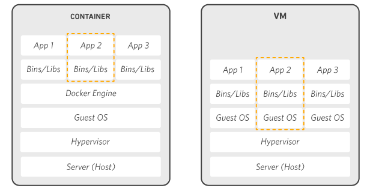
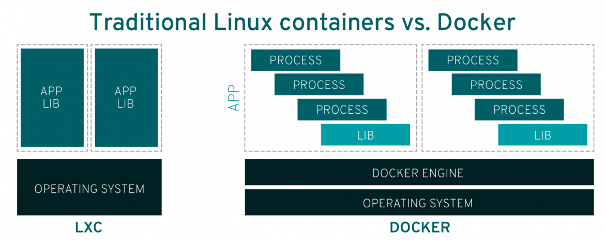
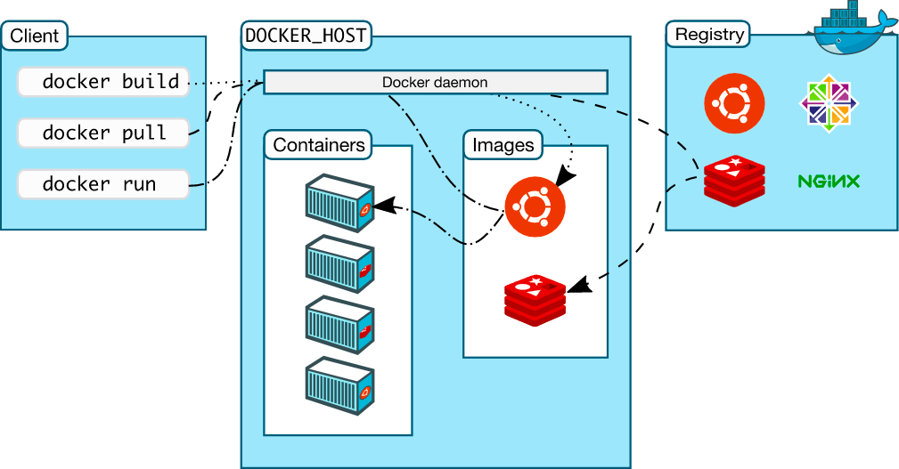

# Docker

# #import

[Docker [Docker.com]](https://www.docker.com/)

[Docker란?[IBM]](https://www.ibm.com/kr-ko/cloud/learn/docker)

[Docker(도커)란?[Red Hat]](https://www.redhat.com/ko/topics/containers/what-is-docker)

---

## Docker?

**`Docker`는 `Container`형 `Application`**의 **빌드, 배치, 관리 기능을 제공하는 오픈 소스 플랫폼**이다.

 

**`Docker`는 `LinuXContainer`를 생성 및 사용할 수 있도록 하는 Container화 기술**로,

**`Docker`는 개발자가 개발한 `Source Code(Application)`를 실행하는 표준 방식을 제공**한다.

쉽게 말해 `Docker`는 `Container` 를 위한 운영 체제(O/S)이다.

**`Docker`를 사용**하면 **`Container`를 아주 가벼운 Module 형식 `VM` 처럼 다룰 수 있다.**

 

**`Docker`를 통해 개발자는 `Application`을, `Container`로 `Packaging`**할 수 있다.

 

**아래 그림**은 **`Container`와 `가상 머신(Virtual Machine)`의 차이점**을 보여준다.

**`VM` 환경에서는 Server 위 `Hypervisor`를 통해 여러개의 `O/S`를 구동**시켜,

**다수의 Application을 구동 시키는 형식**이지만,

 

**`Container`의 경우 하나의 `O/S`위**에,

**`Docker Engine`내에서 여러개의 `Container`를 구동**시켜,

**다수의 Application을 구동** 시킬 수 있다.

 

---

## Container?

**`Docker`에서 사용하는 `Container` 개념 이전**에,

**`Linux O/S`**에는 **`LinuXContainer(LXC)`라는 `Container` 기능이 2008년 부터 제공**되고 있었다. 

이 **`LinuXContainer(LXC)`**는 **단일 `Instance`에 대해 가상화 기능**을,

**Linux 커널 단에서 제공**한다.

 

## Container In Docker

`Docker`에서 `Container`의 개념은,

**`Application` Source Code**를 **임의의 환경에서 실행하기 위해 필요한**,

**`O/S` Library 및 종속 항목**과 **결합**하여 **실행 가능한 표준 Component**이다.

이러한 **`Container`는 분산형으로 분화되는 Application의 실행 환경 Delivery를 간소화**해주며,

**Cloud 환경으로 이전되는 개발환경 상황에서 유용하게 사용**된다.

 

---

## Docker VS LXC

**`Docker`는 `LinuXContainer(LXC)`에 아래와 같은 기능을 추가**하였다.

### 완벽한 이식성

**`LXC`가 간간히 System의 특정 구성을 참조**하는데에 반해,

**`Docker`의 `Container`는 DeskTop, Data Center, Cloud 환경에서 별도의 수정없이도 실행**된다.

### 경량성

**`LXC`를 사용**할 경우 **다수의 Process**를 **하나의 단일 `Container` 안에서 결합**할 수 있다.

**`Docker`의 `Container`를 사용**할 경우, 

**각 `Container`안에서는 하나의 Process만 실행**할 수 있다.

이를 통해서 **Update나 수정사항 반영을 위해 하나의 Process를 중단하는 동안**에도,

**계속해서 실행 가능한 Application을 Build** 할 수 있다.

### 자동 Build

**`Docker`는 Application Souce Code를 기반**으로,

**`Container`를 자동으로 Build**할 수 있다.

### Container Version 관리

**`Docker`는 `Container` 이미지의 버전에 대해**,

**Version Rollback**이나 **Build한 사용자 및 방법 등을 Tracking**할 수 있다.

**더나아가 이전 버전과 신규 버전 사이의 변경점만 Upload할 수 있다.**

### 재사용성

**새로운 `Container`를 생성**할 때,

**기존에 사용하던 `Container`를 Template 형식으로 재사용**하여,

**기본 이미지로 사용하며 생성**할 수 있다.

### 공유성

**자신이 생성한 `Container` 이미지**나 **다른 사람이 생성한 `Container` 이미지**를,

**`Open Source Registry`에 등록 및 참조하여 사용**할 수 있다.

---

# Docker 구조

